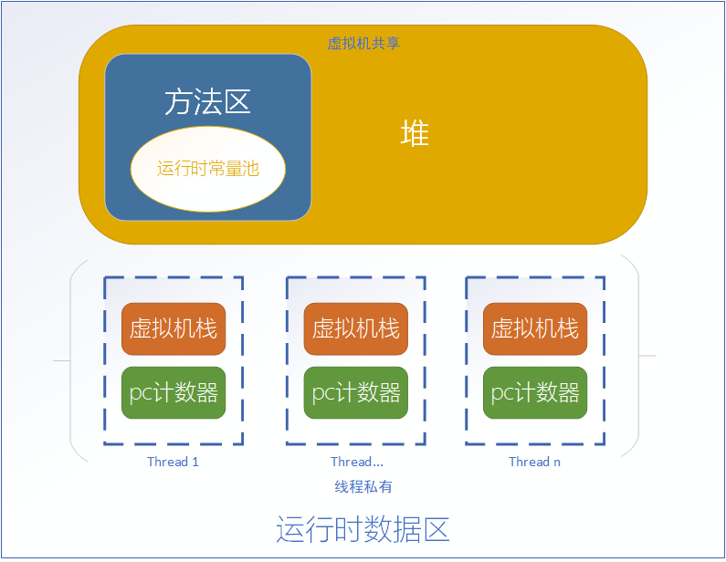
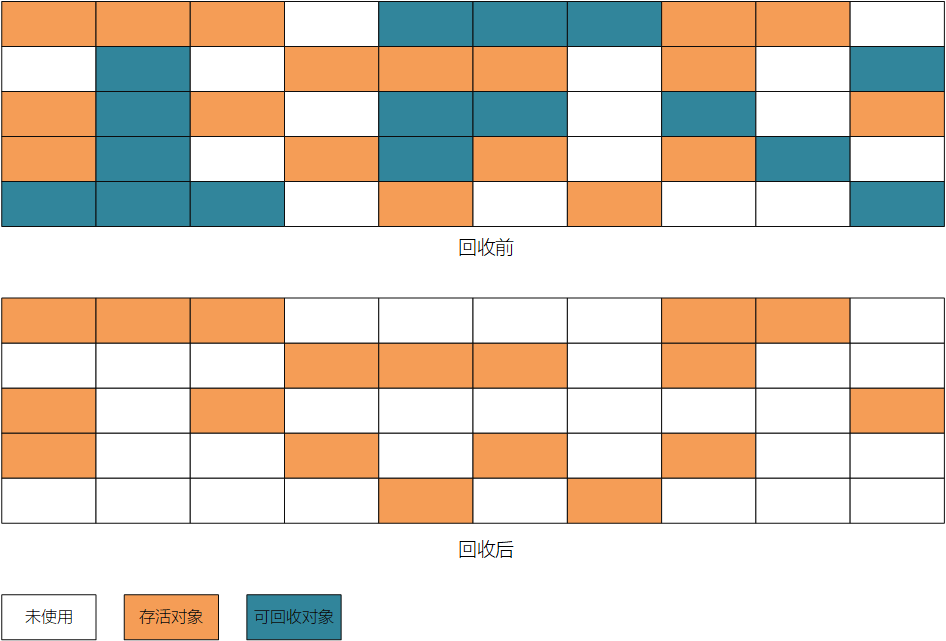
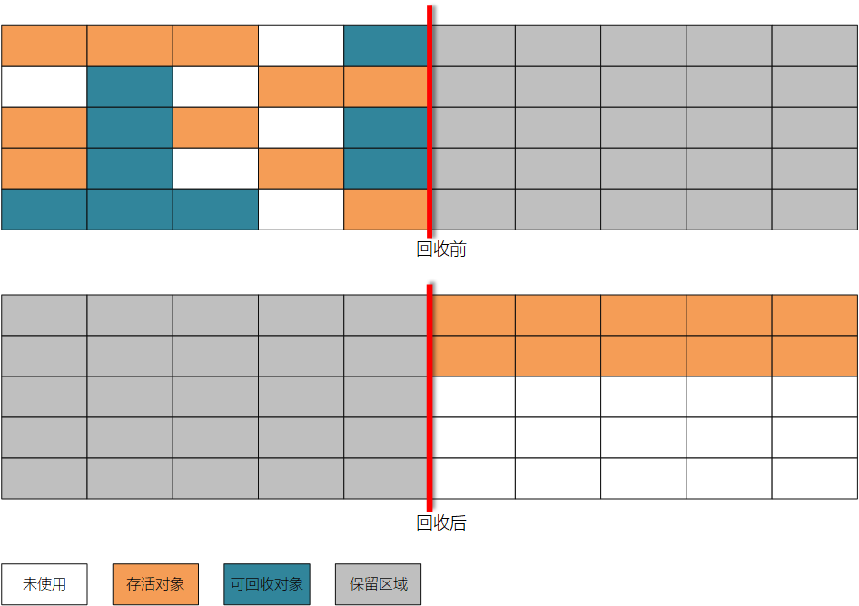
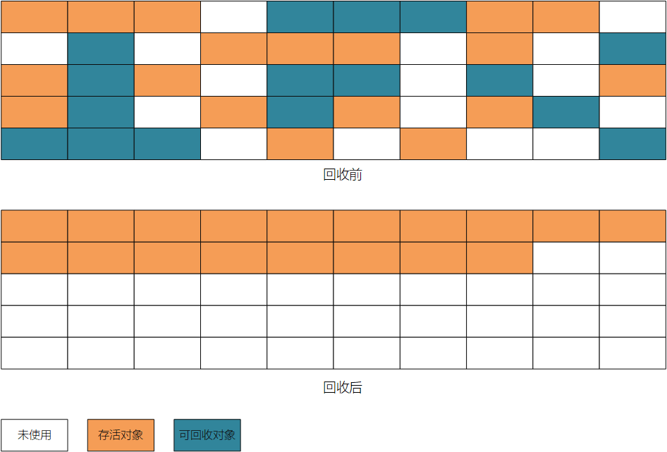
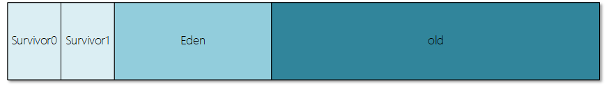
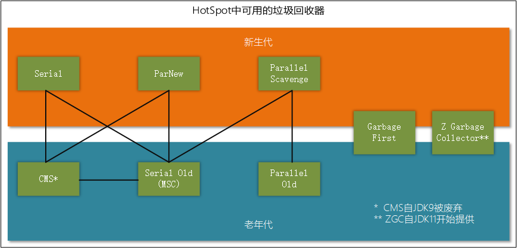
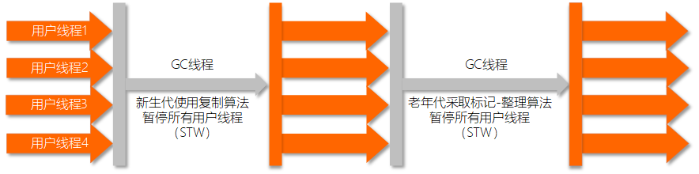
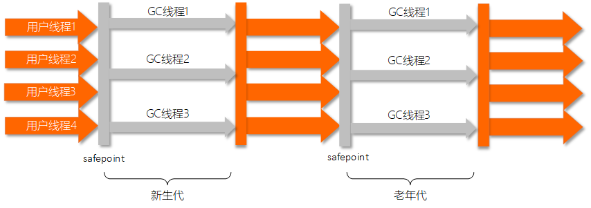
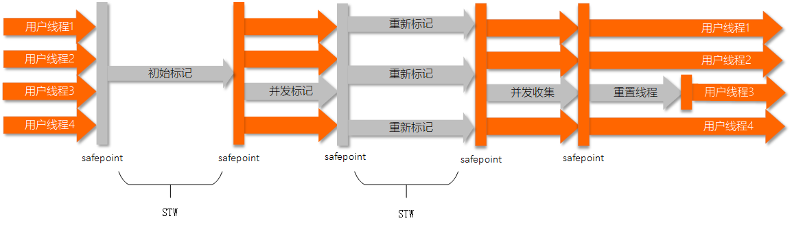

主题

[TOC]

## 1. 内存管理

### 1.1. 内存结构

#### 1.1.1. 堆与非堆

根据虚拟机规范，对于栈空间，或者说线程私有空间，是不使用也不需要垃圾收集机制去管理内存的分配与回收的。而运行时数据空间中线程共有的部分，如方法区、常量池都是实现在堆空间中。因此可以此划分虚拟机内存空间，分为堆和非堆。而在调优过程中，我们主要关注的就是堆空间，垃圾收集器的选择与参数配置。

#### 1.1.2. 运行时数据空间（Run-Time Data Ares）

虚拟机定义了多种运行时数据空间用于执行程序。
其中一些会在虚拟机启动时就创建，直到虚拟机退出后才被销毁。
另一些是和线程绑定的，它们随着线程创建而被开辟，随着线程退出而被销毁。

##### 1.1.2.1. 程序计数器（pc Register）

+ 每个虚拟机线程都有自己私有的程序计数器
+ 任何时候虚拟机线程都在执行当前方法，如果方法不是`native`的，那么计数器将存放当前执行指令的地址，如果方法是`native`的，计数器就处于未定义状态
+ 计数器有足够大小存放返回的地址或者本地指针，所以计数器不会发生OOM

##### 1.1.2.2. Java虚拟机栈（Jva Virtual Machine Stacks）

+ 每个虚拟机线程都有自己私有的虚拟机栈，栈会随着线程创建的同时被开辟出来
+ 栈中存放栈帧
+ 由于虚拟机栈从不被直接操作，除非压入和弹出帧，所以帧有可能在堆中被分配
+ 连续空间对于栈而言不是必须的
+ 虚拟机规范允许栈大小可变或者固定，如果栈大小固定，则每个栈的大小可以在创建时被选定，如果是可变的，则需要指出最大值和最小值
+ 如果线程中的计算需要的栈空间比允许值大，则虚拟机会抛出`StackOverflowError`
+ 如果栈空间是可以动态拓展，且拓展时发现没有足够的可用内存，或者分配新的栈时发现没有足够的可用内存，则虚拟机会抛出`OutOfMemoryError`

##### 1.1.2.3. 堆（Heap）

+ 堆空间为虚拟机所有线程共享，用于分配类实例和数组
+ 堆随着虚拟机启动而一同被创建
+ 堆空间内存管理由自动存储管理系统控制，又称垃圾收集器，对象不允许被直接清理，应由垃圾收集器负责清理
+ 虚拟机不强制指定某个专门的垃圾收集器，可以由虚拟机实例自行配置。
+ 堆空间可以被固定，也可以伸缩，堆占用的内存地址不需要连续
+ 如果运算需要的对空间超过了可分配空间，虚拟机会抛出`OutOfMemoryError`

##### 1.1.2.4. 方法区（Method Area）

+ 方法区为虚拟机所有线程共享
+ 方法区存放类的所有信息
+ 方法区随虚拟机启动一同创建
+ 方法区是堆空间上的一个逻辑分区
+ 规范不要求方法区是否应该被垃圾收集器管理，也不要求方法区是固定大小还是可变大小，更不要求方法区必须放在堆空间上，一切以虚拟机实例的具体实现为准
+ 分配方法区的内存地址不要求连续
+ 方法区不能安全分配空间时，虚拟机会抛出`OutOfMemoryError`

##### 1.1.2.5. 运行时常量池（Run-Time Constant Pool）

+ 运行时常量池是类文件中常量池表的每个类或每个接口的运行时表示（原文：A run-time constant pool is a per-class or per-interface run-time representation of the constant_pool table in a class file (§4.4).）
+ 它包含编译时可知的数字、文本到必须在运行时解析的方法和字段引用
+ 运行时常量池从方法区上分配
+ 运行时常量池随着类或者接口被虚拟机创建而一通创建
+ 当创建类或者接口时，如果运行时常量池需要的空间大于方法区可用空间，虚拟机会抛出`OutOfMemoryError`

##### 1.1.2.6. 本地方法栈（Native Method Stacks）

+ 非java语言编写的虚拟机实例用于支持本语言特性而存在的一个传统数据空间
+ 虚拟机实例不能装载本地方法栈之中的方法
+ 这个空间可以是固定大小的也可以是可变大小的
+ 本空间一般在线程创建时一起创建
+ 如果线程中的计算需要的栈空间比允许值大，则虚拟机会抛出`StackOverflowError`
+ 如果栈空间是可以动态拓展，且拓展时发现没有足够的可用内存，或者分配新的栈时发现没有足够的可用内存，则虚拟机会抛出`OutOfMemoryError`

#### 1.1.3. 虚拟机规范与商用虚拟机的差异

应当明确，虚拟机规范只是定义了虚拟机的主要结构与行为，对于实现细节并没有详细规定。因此，不同的虚拟机实现，往往会在细节上有所不同。

比如oracle的JRockit就没有永久代的概念，HotSpot在开启与JRockit融合工作之前，将方法区和运行时常量池放在永久代里，而永久代又是堆空间的一部分。

再比如，自JDK1.8开始，HotSpot开启与JRockit的融合工作，取消了永久代的设计。将方法区中表示类的数据（meta data）从虚拟机中迁移到本地内存中，其他部分如运行时常量池放入堆中，由垃圾收集器管理。(JEP 122:Remove the Permanent Generation)

### 1.2. 垃圾回收

#### 1.2.1. 定位回收目标

**引用计数器**

> 每个对象自己维护一个计数器，被引用就+1，反之-1。当回收时发现计数器为0就认为是可回收对象。
> 优点：逻辑简单，处理高效
> 缺点：无法处理相互循环引用的情况
> 使用情况：JVM不使用引用计数器作为判断对象回收条件的依据。

**可达性算法**

> 以一些特定的对象作为起点，分析引用链。如果不存在一条引用链，使得被分析对象和特定的起点对象连通，则称为该对象不可达，即应该被回收的对象。
> 优点：基本适用于任何情况，广泛用于现代各类语言的内存管理系统中
> 缺点：分析引用链势必造成代码复杂度升高，执行效率不如引用计数器
> 可以作为根节点的对象：
>
> - 虚拟机栈（栈帧中的本地变量表）中引用的对象
> - 方法区中静态属性引用的对象
> - 方法区中常量引用的对象
> - 本地方法栈中引用的对象

**对引用进行分类**

一刀切不利于表示复杂的对象引用情况，根据对象的预期生命周期以及行为，做出如下分类，不同的类别使用不同的回收策略以达到优化对象管理的目标。

- **强引用**，只要强引用存在就不会被回收，如new关键字实例化出来的对象
- **软引用**，描述一些非必要但是有用的对象，如果系统即将OOM，会尝试回收软引用的对象，回收之后如果可用空间还不够才会抛出OOM
- **弱引用**，也是描述一些非必要但是有用的对象，与软引用不同的是，弱引用的对象会在GC的时候就直接被回收掉，典型应用可以参见ThreadLocal
- **虚引用（幻象引用）**，最弱的一种引用，持有虚引用不会对对象的生命周期造成任何影响。设置这个引用的目的是在对象被回收的时候可以得到一个通知

#### 1.2.2. 如何回收

**标记-清除**

顾名思义，标记不需要的对象，然后删除。
优点：简单直接
缺点：碎片化，效率不高

**复制**

空间分两份，每次只用一份，回收时候从一端将生存的数据复制到另一端，然后抹掉这一端。
优点：不存在碎片化，简单高效
缺点：空间利用率低

**标记-整理**

标记不需要的对象，将生存的对象全部移动到异端，抹掉剩下的部分。
优点：不存在碎片化，不存在空间浪费
缺点：移动相较前面两种显得繁琐

**分代**

针对对象不同的生存时间特点，对不同生命长度的对象用不同的回收策略以求最优匹配。
这种回收策略并不能单独使用，而是与其他回收策略相结合。

#### 1.2.3. 内存管理策略

**新对象优先分配在新生代**

意义
应用分代收集策略之后，针对对象“朝生夕死”的特性，将新对象优先分配在新生代，然后在新生代采用快速的MirrorGC，有利于提高性能。

相关虚拟机参数
参数|说明|示例
---|---|---
-Xmn|新生代大小|-Xmn10M
-XX:SurvivorRatio|Eden区与一个Survivor区的空间比|-XX:SurvivorRatio=8

**大对象直接分配在老年代**

意义
大对象（需要大量连续空间的对象，常见与很长的字符串或者数组）在新生代分配，可能导致新生代频繁GC，且survivor区可能完全无法安置他们。因此直接分配在老年代避免新生代频繁GC

相关虚拟机参数
参数|说明|示意
---|---|---
-XX:PretemureSizeThreshold|设定直接分配在老年代的对象的阀值|-XX:PretemureSizeThreshold=3145728

**长寿命对象晋升老年代**

由于采用分代收集策略，新生代的对象就会有迁移至老年代的途径。用于判断的标准就是新生代中对象熬过GC的次数。

相关虚拟机参数
参数|说明|示意
---|---|---
-XX:MaxTenuringThreshold|对象晋升老年代的阀值|-XX:MaxTenuringThreshold=15

**对象晋升条件动态判断**

为了动态适应不同程序的内存情况，虚拟机并不是永远要求晋升条件满足阀值。在Survivor空间中相同年龄所有对象大小的总和大于Survivor空间的一半，年龄大于或等于该年龄的对象就可以直接进入老年代

**老年代提供空间担保**

由于Survivor区比Eden区小得多，如果一次MirrorGC下存活的对象大于Survivor区，则Survivor区无法容纳所有存货对象，就需要老年代提供空间担保，收容Survivor区无法容纳的对象。如果老年代无法担保，则需要进行一次MajorGC之后再尝试。如果MajorGC后依然无法担保，就会抛出OOM

#### 1.2.4. 垃圾收集器

**影响垃圾回收性能的因素**

- 总堆大小
  最重要的因素就是总可用空间，因为收集发生时，吞吐量与可用空间成反比
- 新生代
  第二重要的因素是新生代所占堆空间比例，越大的新生代，mirrorGC的次数越少，但是老年代空间相应减少，majorGC发生的可能性就会升高。而majorGC比mirroGC更耗时

**可用的垃圾收集器**

- Serial收集器
  Serial收集器用单线程执行所有垃圾回收工作。由于单线程操作回收期间没有线程之间相互通讯影响，单线程回收是相当有效率的。最佳应用场景为单核心设备，因为它无法从多核设备上获得更好的效果。多核设备上也可以用，但是最大数据空间不宜超过100MB。可以通过`-XX:+UseSerialGC`开启。
- Parallel收集器
  Parallel收集器也被称为吞吐量优先收集器，它与Serial收集器类似，主要的区别在于它可以利用多个线程来加速垃圾回收。它用于管理中等大小和更大的数据空间，可以通过`-XX:+UseParallelGC`开启。并行压缩特性允许Parallel收集器加速major收集。不开启并行压缩特性的话major收集过程默认使用单线程，这回造成显著的限制。`-XX:+UseParallelGC`会默认开启并行压缩特性，如果不需要它可以使用`-XX:+UseParallelOldGC`选项禁用。
- 并发收集器
  - CMS
    低延时的垃圾收集器，使用`-XX:+UseConcMarkSweepGC`开启，自JDK9废弃。
  - G1
    为有多个核心与大容量内存的服务器设计的垃圾收集器，可以设置回收延时目标，收集器会尽最大努力保证在目标延时内完成回收，同时还能保证高吞吐量。G1是JDK8以上版本的虚拟机的默认收集器，也可以通过`-XX:+UseG1GC`开启。
- ZGC
  ZGC是为了低延时开发的垃圾收集器，同时还有效利用并发特性，回收时不再停止应用线程的执行。ZGC的目标是极低的延时（少于10ms）和非常大的内存（可达数TB），可以通过`-XX:+UseZGC`开启。不过ZGC目前还处于测试阶段，自JDK11开始提供。

**如何选择垃圾收集器**

除非程序对回收造成的暂停时间有严格的要求，否则应该先让虚拟机自己选择垃圾收集器。
可以通过调整堆空间大小提高虚拟机性能表现，如果这还达不到目标，再考虑如下步骤：

- 如果程序有很小的数据集（最大约100MB），可以尝试使用Serial收集器。
- 如果程序将运行在单核处理器上并且对暂停延时没有要求，可以尝试使用Serial收集器。
- 如果程序的峰值性能要求优先，而没有暂停时间上的约束，或者能接受一秒乃至更长时间的暂停，那么可以尝试使用Parallel收集器
- 如果程序的响应时间比吞吐量更为重要，并且虚拟机因垃圾回收导致的暂停必须保持在一秒以内的话，可以尝试使用G1收集器
- 如果对响应时间有最高要求（几乎随时保持立即响应），或者使用非常大的堆空间的话，可以使用ZGC收集器

##### 1.2.4.2. Serial

**特性**

- 单线程收集器，收集时会暂停所有用户线程，使用一个收集线程完成所有的回收任务。
- 由于STW（stop the world）的存在，该收集器不适合管理超过100M的堆空间，其GC延迟会随着需要处理的空间的增大而增大。
- 在管理少于100M的堆空间时，由于该收集器在单个线程上的表现较其他收集器简单高效，延时往往可以控制在100ms以内，优于其他收集器的表现。

**参数**

开启Serial收集器：`-XX:+UseSerialGC`

**流程**

##### 1.2.4.3. Parallel

**特性**

- 并行收集器，收集时依旧会暂停所有用户线程，即发生STW事件，但是在收集时可以使用多个线程一起完成回收任务，是一个以吞吐量为主要目标的收集器
- 收集器使用的线程数，可以通过命令行指定。如果不指定的话，默认情况下，硬件核心数大于8的设备，收集器使用的线程数等于核心数乘以一个固定的因数。大多数时候这个因数约为5/8，部分特定平台为5/16。如果硬件核心数小于8，那么收集器会使用与硬件核心数相等的线程数用于收集
- 并行收集器在新生代的分配结构和一般情况有区别。主要在于只有一个Survivor区，另一个是Spaces区，如图示（这里我没有找到对Spaces区域的说明）
- 收集器的自适应调节策略。可以设定最大暂停时间，吞吐量和堆大小的目标，收集器会自动优化细节参数用以满足目标，匹配顺序是最大暂停时间>吞吐量>堆空间
- 老年代与新生代大小自适应。默认情况下，被开辟的老年代和新生代的大小可以随着内存使用情况增长或者收缩，类似`ArrayList`中的数组。默认情况下每次增长20%，收缩5%。
- 过长的收集时间与OOM。当收集器花费98%的时间来进行垃圾收集工作，但只有少于2%的堆空间被回收，就会抛出OOM异常。这么做的理由是避免长时间进行没有效率的回收动作
- 新生代使用复制算法，老年代使用标记整理算法

**参数**

开启Parallel收集器： `-XX:+UseParallelGC`
设定线GC程数：`-XX:ParallelGCThreads=<N>`
指定最大暂停时间：`-XX:MaxGCPauseMillis=<N>`
控制新生代增长比例：`-XX:YoungGenerationSizeIncrement=<Y>`
控制老年代增长比例：`-XX:TenuredGenerationSizeIncrement=<T>`
控制堆空间收缩比例：`-XX:AdaptiveSizeDecrementScaleFactor=<D>`
指定吞吐量目标：`X:GCTimeRatio=<N>`
关闭过长收集时间抛出OOM：`-XX:-UseGCOverheadLimit`

**流程**

##### 1.2.4.1. CMS

**特性**

- 并发收集器的一种，以获取最短回收暂停时间为目标，在JDK9中被废弃，指南强烈推荐使用G1，等待ZGC结束试验正式发布之后，个人认为ZGC应该更符合CMS的目标
- 使用标记清除算法
- 初始标记用于标记GC Roots能直接关联到的对象，会STW，但是速度很快
- 并发标记用于追踪引用链
- 重新标记需要STW，以便于记录并发标记期间产生变化的对象
- 并发清理垃圾对象
- 标记使用三色标记法
- C对CPU资源非常敏感
- 不能很好处理浮动垃圾，每次GC都不保证能清理掉所有的垃圾
- 标记-清除算法会导致碎片化，majorGC的过程中必定需要内存碎片整合
- 同样有过长的收集时间导致直接OOM的保护机制

**参数**

**流程**

- 初始标记
- 并发标记
- 重新标记
- 并发清除

##### 1.2.4.4. Garbage First

**特性**

**参数**

**流程**

##### 1.2.4.5. Z Garbage Collector

**特性**

**参数**

**流程**

## 2. 虚拟机执行机制

### 2.1. 字节码文件结构

### 2.2. 类加载机制

#### 2.2.1. 加载流程

类的生命周期包含：

* 加载（Loading）
* 验证（Verification）
* 准备（Preparation）
* 解析（Resolution）
* 初始化（Initialization）
* 使用（Using）
* 卸载（Unloading）

#### 2.2.2. 双亲委派模型

#### 2.2.3. 破坏双亲委派模型

#### 2.2.4. JDK8以来发生的变化

## 3. 排障与调优

### 3.1. 命令行工具

名称|用途
---|---
jps|显示系统内所有虚拟机进程以及启动类
jstat|收集虚拟机各方面运行状态
jinfo|显示虚拟机配置信息
jmap|生成虚拟机内存转储快照
jhat|用于分析内存转储快照
jstack|显示虚拟机的线程快照

### 3.2. 可视化工具

**Jconsole**

**VisualVM**

### 3.3. 虚拟机参数与选项总结

## 4. 项目实例

### 4.1. 由ChemicalTagger对Antlr4的不正确调用引起的内存溢出

参考文献
--

1. 周志明, 《深入理解Java虚拟机》
2. Oracle, 《Java Platform, Standard Edition HotSpot Virtual Machine Garbage Collection Tuning Guide》
3. Tim Lindholm, Frank Yellin, Gilad Bracha, Alex Buckley, Daniel Smith, 《The Java® Virtual Machine Specification Java SE 11 Edition》
4. Sun, 《Memory Management in the Java HotSpot™ Virtual Machine》
5. David Detlefs, Christine Flood, Steve Heller, Tony Printezis, 《GarbageFirst Garbage Collection》
